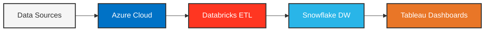

```mermaid
flowchart LR
    A[Data Sources] --> B[Azure Cloud]
    B --> C[Databricks ETL]
    C --> D[Snowflake DW]
    D --> E[Tableau Dashboards]

    classDef default fill:#f5f5f5,stroke:#333,stroke-width:2px
    classDef azure fill:#0072C6,stroke:#333,stroke-width:2px,color:white
    classDef etl fill:#FF3621,stroke:#333,stroke-width:2px,color:white
    classDef dw fill:#29B5E8,stroke:#333,stroke-width:2px,color:white
    classDef viz fill:#E97627,stroke:#333,stroke-width:2px,color:white

    class A default
    class B azure
    class C etl
    class D dw
    class E viz
``` 